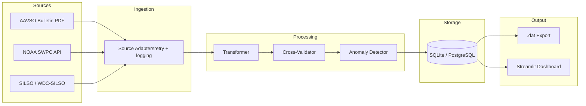

# ☀️ Solar Activity Data Pipeline

Automated ETL pipeline that ingests solar activity indices from multiple authoritative sources, cross-validates them, detects anomalies, and produces analysis-ready datasets for helioseismology research.

Built to replace a manual data collection workflow in the [USC Solar Physics Group](https://dornsife.usc.edu/physics-and-astronomy/), where researchers previously hand-copied Ra values from PDF bulletins and verified them line-by-line.

## Architecture


## Quick Start
```bash
# Clone and setup
git clone https://github.com/HakuyuFujiwara/solar-activity-pipeline.git
cd solar-activity-pipeline
python -m venv .venv
source .venv/bin/activate  # Windows: .venv\Scripts\Activate.ps1
pip install -e ".[dev]"

# Run pipeline (fetches last 30 days of solar data)
python -m src.pipeline --days-back 30

# Launch dashboard
python -m streamlit run src/dashboard/app.py
```

## Usage Examples
```bash
# Fetch specific date range
python -m src.pipeline --start-date 2025-03-01 --end-date 2025-03-31

# Dry run (fetch and validate, don't persist)
python -m src.pipeline --dry-run --days-back 7

# Export legacy .dat file compatible with DailyActivityValuesUpdater
python -m src.pipeline --start-date 2025-03-01 --end-date 2025-03-31 \
    --export-dat --run-number 76 --mdi-day-start 5401

# Initialize database only
python -m src.pipeline --init-db
```

## Tech Stack

| Layer            | Technology                        |
|------------------|-----------------------------------|
| Language         | Python 3.11+                      |
| Database         | SQLite (dev) / PostgreSQL (prod)  |
| ORM              | SQLAlchemy 2.0                    |
| HTTP Client      | httpx + tenacity (retry)          |
| Data Validation  | Pydantic v2                       |
| PDF Parsing      | pdfplumber                        |
| Dashboard        | Streamlit + Plotly                 |
| Testing          | pytest + respx (HTTP mocking)     |
| CI/CD            | GitHub Actions                    |

## Project Structure
```
solar-activity-pipeline/
├── src/
│   ├── config.py               # Centralized configuration (pydantic-settings)
│   ├── ingestion/              # Data source adapters
│   │   ├── base.py             # Abstract base class + SolarObservation model
│   │   ├── aavso.py            # AAVSO bulletin PDF parser (Ra values)
│   │   ├── noaa.py             # NOAA SWPC JSON API (F10.7, SSN)
│   │   └── silso.py            # SILSO CSV endpoint (daily ISN)
│   ├── processing/             # Data quality pipeline
│   │   ├── validator.py        # Multi-source cross-validation
│   │   ├── anomaly.py          # Z-score anomaly detection
│   │   └── transformer.py      # Merge + .dat export
│   ├── storage/                # Persistence layer
│   │   ├── models.py           # SQLAlchemy ORM (3 tables)
│   │   └── database.py         # Upsert + query operations
│   ├── dashboard/
│   │   └── app.py              # Streamlit visualization
│   └── pipeline.py             # Main orchestrator + CLI
└── tests/                      # 29 tests, all passing
    ├── test_ingestion.py       # Mock HTTP tests for all 3 adapters
    └── test_processing.py      # Validation, anomaly, transform tests
```

## Data Sources

| Source | Data | Format | Frequency |
|--------|------|--------|-----------|
| [AAVSO Solar Bulletin](https://www.aavso.org/solar-bulletin) | Relative Sunspot Number (Ra) | Monthly PDF | Monthly |
| [NOAA SWPC](https://www.swpc.noaa.gov) | F10.7 radio flux, SSN | JSON API | Monthly |
| [SILSO / WDC-SILSO](https://www.sidc.be/silso/) | International Sunspot Number | CSV | Daily |

## Design Decisions

**Why parse PDFs instead of using an API for AAVSO?**
AAVSO publishes Ra values exclusively in their monthly Solar Bulletin PDF. There is no public API. The pipeline uses `pdfplumber` to extract Table 2 (American Relative Sunspot Numbers) with regex pattern matching. This directly automates what researchers previously did by hand.

**Why SQLite for development?**
Zero configuration, ships with Python. The codebase uses SQLAlchemy ORM, so switching to PostgreSQL requires only changing the `DATABASE_URL` environment variable. No code changes needed.

**Why cross-validate Ra against ISN?**
AAVSO Ra and SILSO ISN both measure sunspot activity but use different observer networks and statistical methods. Discrepancies can indicate data quality issues. The validator flags deviations exceeding a configurable threshold (default 20%).

**Why graceful degradation?**
If one data source is unavailable (e.g., AAVSO hasn't published this month's bulletin yet), the pipeline continues with the remaining sources. Partial data is better than no data.

## Dashboard

The Streamlit dashboard provides interactive visualization of ingested data:

- Time series view with metric selector (Ra, ISN, F10.7)
- AAVSO Ra vs SILSO ISN daily comparison chart
- Data source coverage summary
- Raw data explorer and anomaly table

## Testing
```bash
# Run all tests
pytest tests/ -v

# Run with coverage
pytest tests/ --cov=src --cov-report=term-missing
```

29 tests covering ingestion (HTTP mocking with respx), cross-validation logic, anomaly detection edge cases, data transformation, and .dat export format.

## Background

This project was developed in the context of the USC Solar Physics Group's helioseismology research. The group processes HMI (Helioseismic and Magnetic Imager) solar oscillation data through a multi-stage pipeline on the USC Discovery HPC cluster. Solar activity indices are required for the regression analysis stage (Part 6 of the pipeline), where frequency shifts are correlated against activity indicators.

The legacy workflow involved manually downloading AAVSO Solar Bulletins, copying Ra values into a C++ program (`DailyActivityValuesUpdater`), and visually verifying the output against source data. This pipeline automates that entire process.

## License

MIT