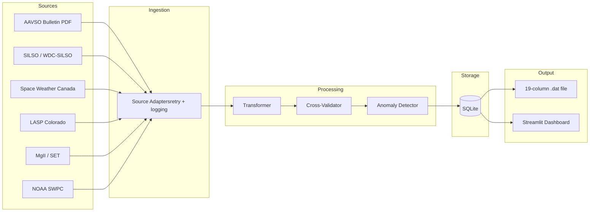

# ☀️ Solar Activity Data Pipeline

Automated ETL pipeline that replaces the legacy C++ `DailyActivityValuesUpdater` program. Ingests solar activity indices from 6 authoritative sources, cross-validates them, detects anomalies, and produces the identical 19-column `.dat` file used in the USC Solar Physics Group's helioseismology pipeline.

**Before:** Manually download 5 data files, open a PDF to copy Ra values line by line, run an interactive C++ program. ~1-2 hours.

**After:** `./generate_run.sh 76` — 30 seconds, fully automatic.

## Architecture


## Quick Start

### On HPC (Discovery / CARC)
```bash
/project2/erhodes_44/dongpoba/solar-activity-pipeline/generate_run.sh 76
```

That's it. Output goes to:
`/project2/erhodes_44/rcf-04/astro10/data/mdi/lnu/comparison/dailyactivityvalueshmirun76.dat`

### Local Development
```bash
git clone https://github.com/HakuyuFujiwara/solar-activity-pipeline.git
cd solar-activity-pipeline
python -m venv .venv
source .venv/bin/activate  # Windows: .venv\Scripts\Activate.ps1
pip install -e ".[dev]"

python -m src.pipeline --run 76
```

## Usage
```bash
# Generate any run (dates auto-computed, no lookup table needed)
./generate_run.sh 76
./generate_run.sh 77
./generate_run.sh 80

# Dry run (fetch and validate, don't write to database)
python -m src.pipeline --run 76 --dry-run

# Custom date range
python -m src.pipeline --start-date 2025-01-01 --end-date 2025-03-31

# Export .dat with manual parameters
python -m src.pipeline --start-date 2025-03-01 --end-date 2025-03-31 \
    --export-dat --run-number 76 --mdi-day-start 11728

# Launch dashboard
python -m streamlit run src/dashboard/app.py
```

## Data Sources

| Source | Data | .dat Column | Format |
|--------|------|-------------|--------|
| [AAVSO Solar Bulletin](https://www.aavso.org/solar-bulletin) | Relative Sunspot Number (Ra) | 9 | Monthly PDF (auto-parsed) |
| [SILSO / WDC-SILSO](https://www.sidc.be/silso/) | International Sunspot Number | 8 | CSV (daily) |
| [Space Weather Canada](https://www.spaceweather.gc.ca) | 10.7cm Solar Radio Flux | 10 | Text (selects 20:00 UTC reading) |
| [LASP Colorado](https://lasp.colorado.edu) | SDO/SOHO SEM UV Flux | 13-14 | Text (yearly files) |
| [Space Environment Tech](https://sol.spacenvironment.net) | MgII Core-to-Wing Ratio | 19 | Text (daily) |
| [NOAA SWPC](https://www.swpc.noaa.gov) | F10.7, SSN monthly average | validation | JSON API |

All data is fetched directly from source URLs at runtime. No manual file downloads needed.

## Output Format

The 19-column `.dat` file is identical to the legacy `DailyActivityValuesUpdater` output:
```
 5257 9029 2024 09 19 2024.717  -1. 105.  89. 162.6 -1.0000000 -1.0000000 3.14021E+10 1.53883E+10   -1.0000   -1.0000 -1.000 -1.000 0.281406
```

| Columns | Content |
|---------|---------|
| 1-2 | MDI Day Number + Offset (auto-computed from date) |
| 3-6 | Date (Year, Month, Day, Fractional Year) |
| 7 | Placeholder |
| 8-9 | ISN (SILSO) and Ra (AAVSO) |
| 10 | F10.7 adjusted flux (Space Weather Canada, 20:00 UTC) |
| 11-12 | Placeholders |
| 13-14 | SEM UV flux (LASP) |
| 15-18 | Placeholders |
| 19 | MgII Core-to-Wing ratio |

## Run Number System

Run dates are auto-computed from an anchor point. No lookup table to maintain.

Each run is exactly 72 days (24 three-day sets), consecutive with no gaps. Given any run number, the program calculates the start date, end date, and JSOC day number automatically, handling leap years and month boundaries.
```bash
# Check any run's dates
python -c "from src.run_registry import get_run; r = get_run(77); print(f'{r.start_date} to {r.end_date}')"
```

## Tech Stack

| Layer | Technology |
|-------|-----------|
| Language | Python 3.11+ |
| Database | SQLite (dev) / PostgreSQL (prod) |
| ORM | SQLAlchemy 2.0 |
| HTTP | httpx + tenacity (auto-retry) |
| Validation | Pydantic v2 |
| PDF Parsing | pdfplumber |
| Dashboard | Streamlit + Plotly |
| Testing | pytest + respx (HTTP mocking) |
| CI/CD | GitHub Actions |

## Project Structure
```
solar-activity-pipeline/
├── generate_run.sh             # One-command wrapper (auto-updates from GitHub)
├── src/
│   ├── config.py               # Centralized configuration (pydantic-settings)
│   ├── run_registry.py         # Auto-compute run dates from anchor point
│   ├── ingestion/              # 6 data source adapters
│   │   ├── base.py             # Abstract base class + SolarObservation model
│   │   ├── aavso.py            # AAVSO PDF parser (with typo fallback)
│   │   ├── silso.py            # SILSO CSV parser
│   │   ├── noaa.py             # NOAA SWPC JSON API
│   │   ├── spaceweather_ca.py  # 10.7cm flux (20:00 UTC selection)
│   │   ├── lasp.py             # SDO/SOHO SEM UV
│   │   └── mgii.py             # MgII Core-to-Wing ratio
│   ├── processing/
│   │   ├── validator.py        # Ra vs ISN cross-validation
│   │   ├── anomaly.py          # Z-score anomaly detection
│   │   └── transformer.py      # Merge + 19-column .dat export
│   ├── storage/
│   │   ├── models.py           # SQLAlchemy ORM (3 tables)
│   │   └── database.py         # Upsert + query operations
│   ├── dashboard/
│   │   └── app.py              # Streamlit visualization
│   └── pipeline.py             # Main orchestrator + CLI
├── tests/                      # 29 tests, all passing
├── USAGE.md                    # Quick reference
└── DEPLOY_HPC.md               # HPC deployment guide
```

## Design Decisions

**Why parse PDFs instead of using an API for AAVSO?**
AAVSO publishes Ra values exclusively in monthly Solar Bulletin PDFs. There is no API. The adapter uses `pdfplumber` to extract Table 2 with regex matching, and includes fallback for filename typos (e.g., `AAVO_SB` instead of `AAVSO_SB`).

**Why auto-compute run dates instead of a lookup table?**
Every HMI run is exactly 72 days, consecutive with no gaps. One anchor point (Run 74 = 2024-09-19) is enough to compute any run's dates. This eliminates maintenance and human error.

**Why 6 data sources?**
The legacy C++ program required 5 manually downloaded files plus hand-copied Ra values. This pipeline fetches all 6 sources automatically, with retry on network failures and graceful degradation if any source is temporarily unavailable.

**Why graceful degradation?**
AAVSO bulletins are published monthly with a delay. Other sources may have temporary outages. The pipeline continues with whatever data is available, marking missing values as -1 in the output.

**Why SQLite over PostgreSQL for HPC?**
Zero configuration, ships with Python, works on Discovery without admin privileges. The codebase uses SQLAlchemy ORM, so switching to PostgreSQL requires only changing the `DATABASE_URL` environment variable.

## Testing
```bash
pytest tests/ -v
pytest tests/ --cov=src --cov-report=term-missing
```

29 tests covering all adapters (mocked HTTP), cross-validation, anomaly detection, data transformation, and .dat export format.

## Background

Developed for the USC Solar Physics Group's helioseismology research. The group processes HMI (Helioseismic and Magnetic Imager) solar oscillation data on the USC Discovery HPC cluster. Solar activity indices are required for the regression analysis stage, where p-mode frequency shifts are correlated against activity indicators.

## License

MIT